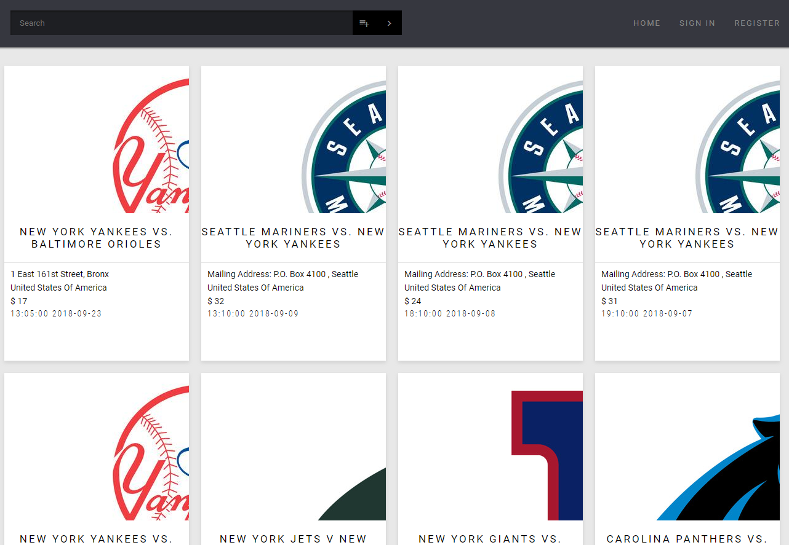
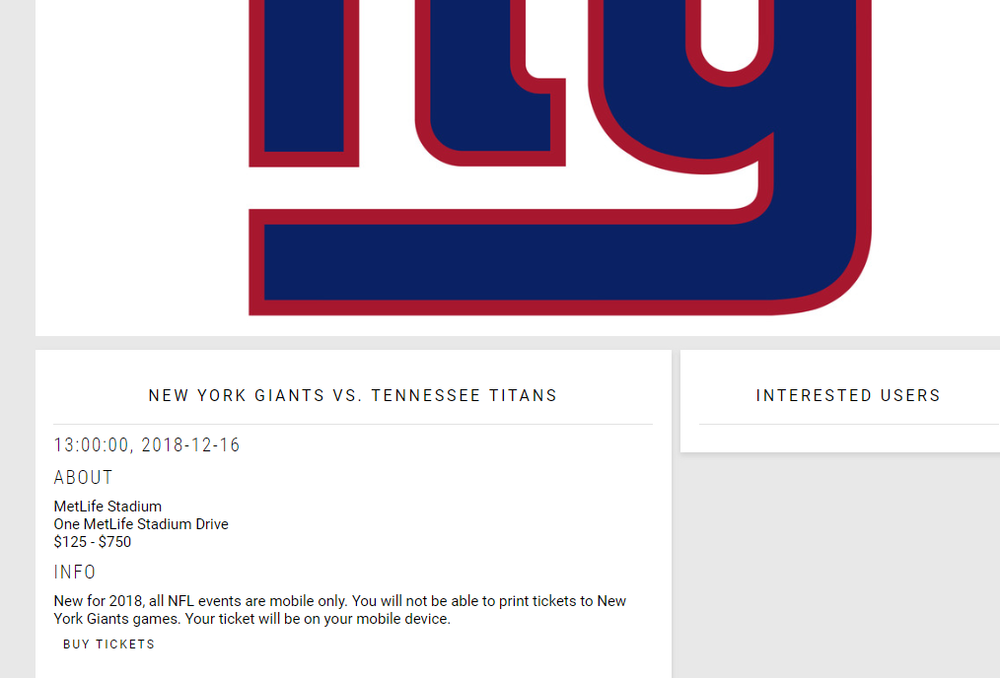

# Event Network
### Web Application Features




*Search* - Our application has a search function to allow users to discover new events. It has several filters (e.g. by title, city, start date, or type) to assist users in narrowing down their search to only events that they're interested in.

*Event Details* - Users can click on each event card brought up by the search to get additional information about each event. They can get to know the place, time, and price of an event. They can also see a list of users who are interested in the event.

*User Accounts* - Our web app allows users to create an account by registering their information. The login system requires a username and password. Passport allows a variety of different users to login and manage their own data.

*Interested Events* - Users can make an account to save events that they're interested in. These events will be noted on your user profile, which is also visible to other users. Account holders can add or delete events from their list at will. Each event also features a list of users who have declared their interest.

## Viewing the application locally
### Installing the dependencies

Go to server and client directory.

Run 'npm install' for dependencies.

```javascript
npm install
```

### Starting the application

Go to server or client directory.

Run 'npm start' for starting the client and server.

```javascript
npm start
```
It will locally run on 0.0.0.0:3000

## Viewing the application online
Deployed via heroku.
Our application can be viewed at https://a3client.herokuapp.com/

### Contributors
Hyewon Choi
Eric Hu
Jing Yi Xie
Hsiang-Chi Yang

Jing Yi Xie 1002543811
Hsiang-Chi Yang 1002330328
